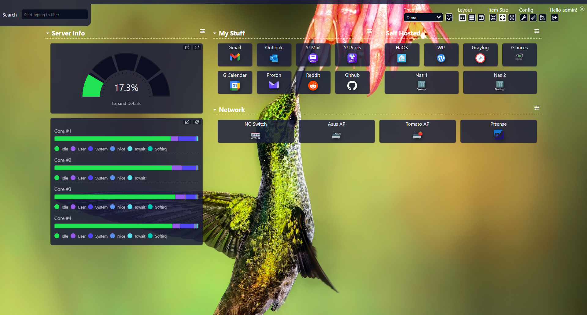

# Dashy Tama Theme



This project contains a custom theme for [Dashy](https://github.com/Lissy93/dashy).  The theme is based on the built-in Adventure theme and has the following additions:

- a random background image from [Unsplash.com](https://unsplash.com/) (on every page load) and can be customized
- added transparent background tile for Widgets (to match the Items one)
- transparent header & footer (and other minor stuff)

## Usage

To kick the tires, the docker-compose.yml should be pretty self explanatory and is ready to start up.

### Adding Custom Theme

To use the custom theme in your own Dashy:

- copy the `./themes/user-defined-themes.scss` into your own project and mount/copy it into `/app/src/styles/user-defined-themes.scss`
- add an in `cssThemes: ['Tama']` entry into your conf.yml file as shown in the example below so that Tama theme will appear in the theme drop down

```yaml
appConfig:
  cssThemes: ['Tama']
  theme: Tama
  layout: auto
```

Read the [Dashy docs](https://github.com/Lissy93/dashy/blob/master/docs/theming.md#adding-your-own-theme) for more details.

### Customizing the Random Image

To tailor what type of random image is loaded, edit the following line in `./themes/user-defined-themes.scss` and substitue your own query terms after the `?` for what you want:

```css
background: url('https://source.unsplash.com/random/1920x1080/?calm,nature,background');
```
